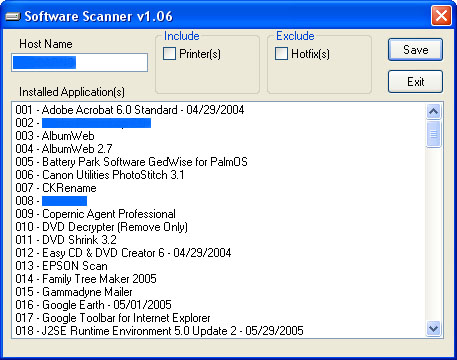



## Software Scanner v1\.06

### Description

This program will display a list of installed programs and gives the user an option to save this list as a text file. I use this prior to formatting and re-installing windows. It will also include a list if installed printers
 
### More Info
 

             |
---                |---
**Submitted On**   |2005-10-06 21:21:24
**By**             |[R Edwards](https://github.com/Planet-Source-Code/PSCIndex/blob/master/ByAuthor/r-edwards.md)
**Level**          |Intermediate
**User Rating**    |5.0 (25 globes from 5 users)
**Compatibility**  |VB 6\.0
**Category**       |[Complete Applications](https://github.com/Planet-Source-Code/PSCIndex/blob/master/ByCategory/complete-applications__1-27.md)
**World**          |[Visual Basic](https://github.com/Planet-Source-Code/PSCIndex/blob/master/ByWorld/visual-basic.md)
**Archive File**   |[Software\_S1938171062005\.zip](https://github.com/Planet-Source-Code/r-edwards-software-scanner-v1-06__1-62798/archive/master.zip)

